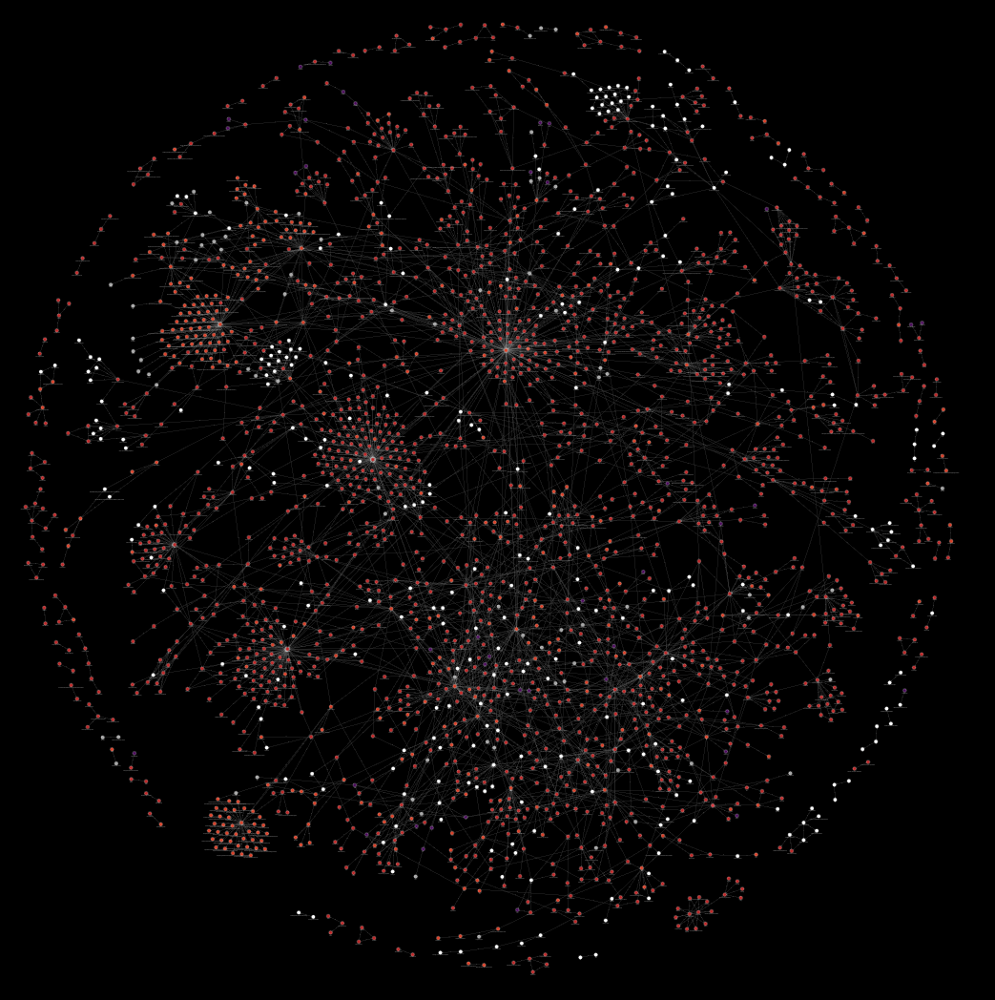

<h1 align="center">Teaching to Understand, Understanding to Teach: Retrieval Augmented Generation for Requirements Traceability</h1>

  
  
  
  

  
   
  <em>An example knowledge graph visualizing traceability links between requirements.</em>

***

## Abstract
> Requirement traceability, validation, and verification can become difficult within engineering projects, notably as they scale. Technical specification documents detailing these structured processes are primarily expressed using natural language. With the adoption of Large Language Models (LLMs) and their effectiveness in natural language processing tasks such as information and relationship extraction, specification documents can be leveraged. While traditional requirement and test engineering methods rely on human thinking, smaller models can perform goal-aligned reasoning when trained with human feedback. We propose an approach for requirement traceability using Light Retrieval-Augmented Generation (RAG) by fine-tuning an LLM for improved knowledge discovery, primarily entity-relationship extraction. Our approach seeks to induce traceability, which emerges from the knowledge graph component of the RAG system by evaluating responses with human expert feedback for alignment. Motivated by the Feynman Technique, we reinforce areas of misunderstanding or misalignment in LLM-based tasks by fine-tuning with Direct Preference Optimization (DPO), which adjusts from response pairs—inadequate (incorrect) and expert-improved (correct). Quantized Low-Rank Adaptation (QLoRA) is employed to optimize fine-tuning under hardware constraints. The implication is linkage between a provided input and a ranked output set as an emergent property of the model’s understanding. Metrics are derived from human cueing and imitation tests.

***

### **Project & Publication Details**

| **Resource** | **Details** |
| :--- | :--- |
| **Original Code** | [bedolpab/tuutrag](https://github.com/bedolpab/tuutrag) |
| **NASA Release** | [RAG for Requirements: Teaching LLMs to Trace and Reason](https://software.nasa.gov/software/NPO-53610-1) |
| **Reference Number** | NPO-53610-1 |
| **Category** | Aeronautics |
| **Release Type** | Open Source |

***

### **Technology Stack**
`Python >=3.11`, `Pytorch`, `Qdrant`, `Memgraph`, `Unsloth AI`, `OpenAI`, `Transformers`, `Hugginface`
***

### **Development Guidelines**

Please ensure you are following Conventional Commits for your commit messages.
Please ensure you are following Conventional Branches for branch naming.
Two developer approvals are required on any pull request.

  
  

***

### **Team & Collaborators**

| **Role** | **Name** | **Affiliation** |
| :--- | :--- | :--- |
| **Mentor** | Gus Razo | Jet Propulsion Laboratory/California Institute of Technology |
| **Mentor** | Kae Sawada | Jet Propulsion Laboratory/California Institute of Technology |
| **Mentor** | Edwin Quintanilla | Jet Propulsion Laboratory/California Institute of Technology |
| **Academic Collaborator/Intern** | Pablo Cesar Bedolla Ortiz | Dominican University |
| **Academic Collaborator** | Marlon Selvi | Dominican University |
| **Academic Collaborator** | Eduardo Gaborit | University of Illinois Urbana-Champaign |

***

### **NASA-JPL/Caltech Acknowledgement**

This research was carried out at the Jet Propulsion Laboratory, California Institute of Technology, and was sponsored by the National Aeronautics and Space Administration. This work is currently being continued at Dominican University.